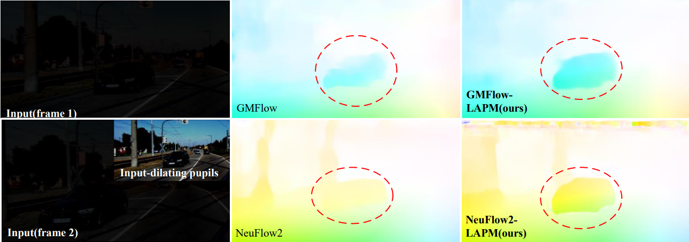

# [用于暗光交通场景目标感知的生物启发的视觉模型](https://doi.org/10.1016/j.eswa.2025.129529)

## Dark-traffic 数据集
可用于低光条件下的交通场景的目标检测、实例分割和光流估计。包括~10k 图像和~100k标注，地址： [Google Drive](https://drive.google.com/drive/folders/1B8EzDn64bGBgyRCfppL_jhcOA3hIwnzi?usp=sharing)

图像现已开放访问，标注文件将在期刊/会议处理完毕后开放。

- 更新(9.5 2025): 论文期刊版本已发布，标注(目标检测/实例分割/光流估计)在谷歌云盘已可用
- 更新(9.7 2025): 代码 (SLVM 用于 静态+运动 感知) 正在准备以用于发布
- 更新(9.9 2025): 代码 (SLVM 用于 运动 感知) 已发布
- 更新(9.24 2025): 代码 (SLVM 用于 静态 感知) 已发布

### SLVM 在静态感知(检测、分割等)上的优势
训练步骤将很快更新

### SLVM 在运动感知(光流等)上的优势

 ## 参考
  - https://github.com/AlanLi1997/slim-neck-by-gsconv
  - https://github.com/AlanLi1997/rethinking-fpn
  - https://github.com/ultralytics/ultralytics
  - https://github.com/haofeixu/gmflow
  - https://github.com/neufieldrobotics/NeuFlow_v2