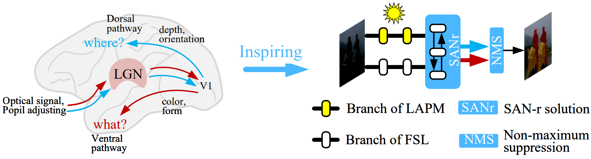

# 用于暗光交通场景目标感知的生物启发的视觉模型

## Dark-traffic 数据集
可用于低光条件下的交通场景的目标检测、实例分割和光流估计。包括~10k 图像和~100k标注，地址： [Google Drive](https://drive.google.com/drive/folders/1B8EzDn64bGBgyRCfppL_jhcOA3hIwnzi?usp=sharing)

图像现已开放访问，标注文件将在期刊/会议处理完毕后开放。

 ## 参考
  - https://github.com/AlanLi1997/slim-neck-by-gsconv
  - https://github.com/AlanLi1997/rethinking-fpn
  - https://github.com/ultralytics/ultralytics
  - https://github.com/haofeixu/gmflow