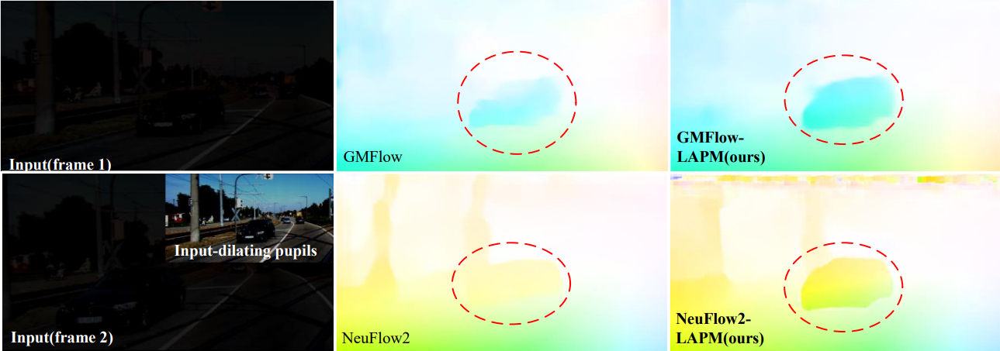

# A Biologically Inspired Separable Learning Vision Model for Real-time Traffic Object Perception in Dark

[简体中文](README-zh-CN.md) | [English](README.md)
 

## Dark-traffic benchmark
(object detection, instance segmentation, and optical flow estimation in the low-light traffic conditions)

images (~10k) and annotations (~100k) in [Google Drive](https://drive.google.com/drive/folders/1B8EzDn64bGBgyRCfppL_jhcOA3hIwnzi?usp=sharing)

The images are now available, and annotations will be released after the paper is processed by the journal/conference.

### SLVM for optical flow

## Re-produce
        python pip install -requirements.txt
 ## References
  - https://github.com/AlanLi1997/slim-neck-by-gsconv
  - https://github.com/AlanLi1997/rethinking-fpn
  - https://github.com/ultralytics/ultralytics
  - https://github.com/haofeixu/gmflow
  - https://github.com/neufieldrobotics/NeuFlow_v2
